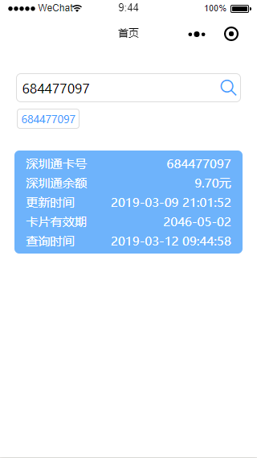

# szt-balance
深圳通余额查询小程序

### 安装依赖

	npm install

### DEV环境运行

	npm run dev:weapp

### 预览结果

打开[微信开发者工具](https://developers.weixin.qq.com/miniprogram/dev/devtools/download.html?t=19031416)，打开项目根目录即可预览

---

### License

---

[LICENSE](https://github.com/mvpleung/szt-balance/blob/master/LICENSE)

